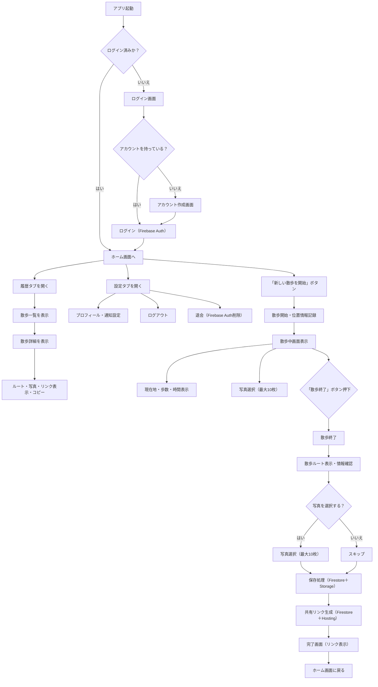

```mermaid
flowchart TD
    A[アプリ起動] --> B{ログイン済みか？}
    B -- はい --> C[ホーム画面へ]
    B -- いいえ --> B1[ログイン画面]
    B1 --> B1a{アカウントを持っている？}
    B1a -- はい --> B2[ログイン（Firebase Auth）]
    B1a -- いいえ --> B3[アカウント作成画面]
    B3 --> B2
    B2 --> C

    %% ホーム画面
    C --> C1[履歴タブを開く]
    C1 --> C1a[散歩一覧を表示]
    C1a --> C1b[散歩詳細を表示]
    C1b --> C1c[ルート・写真・リンク表示・コピー]

    C --> C2[設定タブを開く]
    C2 --> C2a[プロフィール・通知設定]
    C2 --> C2b[ログアウト]
    C2 --> C2c[退会（Firebase Auth削除）]

    C --> D[「新しい散歩を開始」ボタン]
    D --> E[散歩開始・位置情報記録]
    E --> F[散歩中画面表示]
    F --> F1[現在地・歩数・時間表示]
    F --> F2[写真選択（最大10枚）]
    F --> G{「散歩終了」ボタン押下}

    G --> H[散歩終了]
    H --> H1[散歩ルート表示・情報確認]
    H1 --> H2{写真を選択する？}
    H2 -- はい --> H3[写真選択（最大10枚）]
    H2 -- いいえ --> H4[スキップ]

    H3 --> I[保存処理（Firestore＋Storage）]
    H4 --> I
    I --> J[共有リンク生成（Firestore＋Hosting）]
    J --> K[完了画面（リンク表示）]
    K --> L[ホーム画面に戻る]

```
