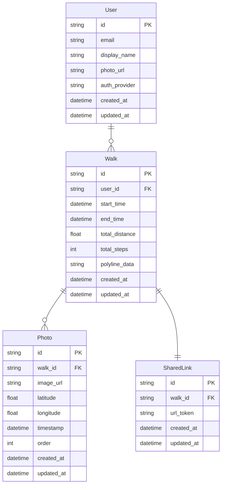

- User
    - テーブル概要
        - ユーザーに関連する情報を格納するテーブル。
    - 属性
        - id (PK): ユーザーを一意に識別するID（主キー）
        - email: ユーザーのメールアドレス
        - display_name: アプリ内で表示されるユーザーの名前
        - photo_url: ユーザーのプロフィール画像URL
        - auth_provider: 認証の方法(GoogleやEmailなどの認証サービス)
- Walk
    - テーブル概要
        - 散歩記録に関する情報を格納するテーブル。ユーザーが行った散歩の詳細情報を保存する。
    - 属性
        - id (PK): 散歩の一意識別子
        - user_id (FK): 散歩を記録したユーザーのID（外部キー)
        - start_time: 散歩の開始時刻
        - end_time: 散歩の終了時刻
        - total_distance: 散歩した総距離
        - total_steps: 散歩中に歩いた総歩数
        - polyline_data: 散歩ルートを表すデータ（地図上に表示する線の情報）
- Photo
    - テーブル概要
        - ユーザーが散歩中に撮影した写真に関する情報を格納するテーブル。
    - 属性
        - id (PK): 写真の一意識別子
        - walk_id (FK): この写真が関連する散歩のID（外部キー）
        - image_url: 写真が保存されているURL
        - latitude: 写真が撮影された場所の緯度
        - longitude: 写真が撮影された場所の経度
        - timestamp: 写真が撮影された時刻
        - rder: 複数枚の写真がある場合の表示順（1～10の番号など）
- SharedLink
    - テーブル概要
        - 散歩記録を共有するためのリンク情報を格納するテーブル。これによりユーザーはリンクを生成して他の人と散歩記録を共有できる。
    - 属性
        - id (PK): 共有リンクの一意識別子
        - walk_id (FK): 共有される散歩のID（外部キー）
        - url_token: 共有リンクを一意に識別するためのトークン
