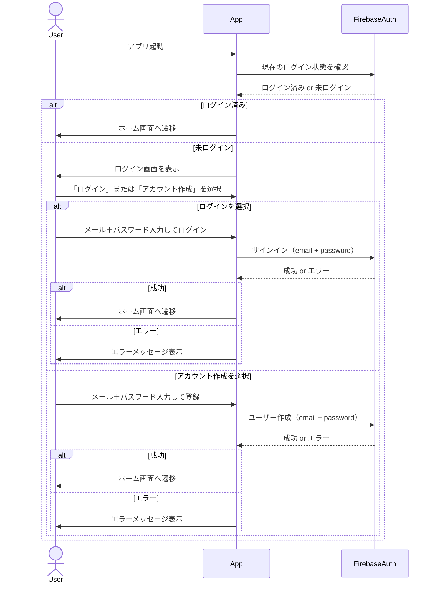

## ログインまたはアカウント作成のシーケンス図（Firebase Auth）

```mermaid
sequenceDiagram
    actor User
    participant App
    participant FirebaseAuth

    User ->> App: アプリ起動
    App ->> FirebaseAuth: 現在のログイン状態を確認
    FirebaseAuth -->> App: ログイン済み or 未ログイン

    alt ログイン済み
        App ->> User: ホーム画面へ遷移
    else 未ログイン
        App ->> User: ログイン画面を表示
        User ->> App: 「ログイン」または「アカウント作成」を選択

        alt ログインを選択
            User ->> App: メール＋パスワード入力してログイン
            App ->> FirebaseAuth: サインイン（email + password）
            FirebaseAuth -->> App: 成功 or エラー

            alt 成功
                App ->> User: ホーム画面へ遷移
            else エラー
                App ->> User: エラーメッセージ表示
            end

        else アカウント作成を選択
            User ->> App: メール＋パスワード入力して登録
            App ->> FirebaseAuth: ユーザー作成（email + password）
            FirebaseAuth -->> App: 成功 or エラー

            alt 成功
                App ->> User: ホーム画面へ遷移
            else エラー
                App ->> User: エラーメッセージ表示
            end
        end
    end

```
