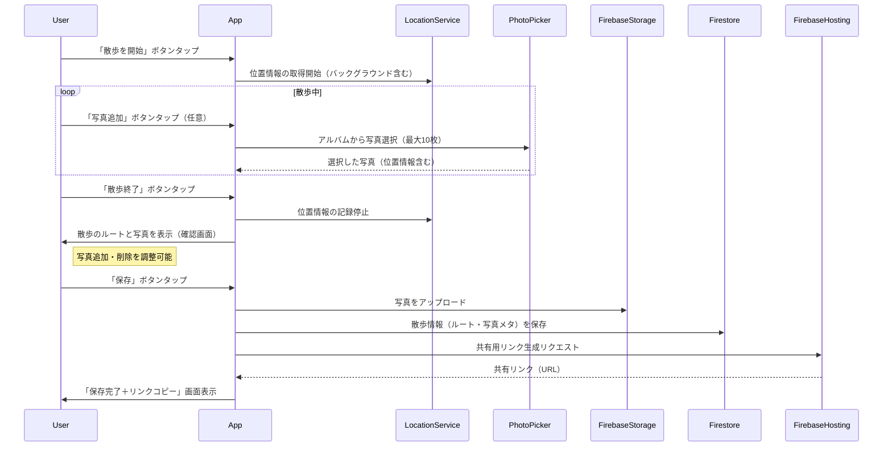

## 散歩の開始〜終了〜保存〜共有までのフロー

```mermaid
sequenceDiagram
    participant User
    participant App
    participant LocationService
    participant PhotoPicker
    participant FirebaseStorage
    participant Firestore
    participant FirebaseHosting

    User ->> App: 「散歩を開始」ボタンタップ
    App ->> LocationService: 位置情報の取得開始（バックグラウンド含む）

    loop 散歩中
        User ->> App: 「写真追加」ボタンタップ（任意）
        App ->> PhotoPicker: アルバムから写真選択（最大10枚）
        PhotoPicker -->> App: 選択した写真（位置情報含む）
    end

    User ->> App: 「散歩終了」ボタンタップ
    App ->> LocationService: 位置情報の記録停止
    App ->> User: 散歩のルートと写真を表示（確認画面）

    Note right of User: 写真追加・削除を調整可能

    User ->> App: 「保存」ボタンタップ
    App ->> FirebaseStorage: 写真をアップロード
    App ->> Firestore: 散歩情報（ルート・写真メタ）を保存
    App ->> FirebaseHosting: 共有用リンク生成リクエスト
    FirebaseHosting -->> App: 共有リンク（URL）

    App ->> User: 「保存完了＋リンクコピー」画面表示

```
