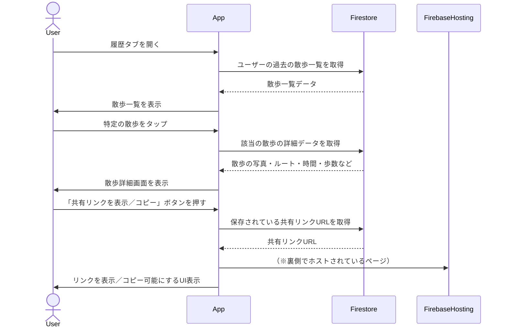

## 履歴の散歩詳細表示〜共有リンクの再取得

```mermaid
sequenceDiagram
    actor User
    participant App
    participant Firestore
    participant FirebaseHosting

    User ->> App: 履歴タブを開く
    App ->> Firestore: ユーザーの過去の散歩一覧を取得
    Firestore -->> App: 散歩一覧データ
    App ->> User: 散歩一覧を表示

    User ->> App: 特定の散歩をタップ
    App ->> Firestore: 該当の散歩の詳細データを取得
    Firestore -->> App: 散歩の写真・ルート・時間・歩数など
    App ->> User: 散歩詳細画面を表示

    User ->> App: 「共有リンクを表示／コピー」ボタンを押す
    App ->> Firestore: 保存されている共有リンクURLを取得
    Firestore -->> App: 共有リンクURL
    App ->> FirebaseHosting: （※裏側でホストされているページ）
    App ->> User: リンクを表示／コピー可能にするUI表示

```
