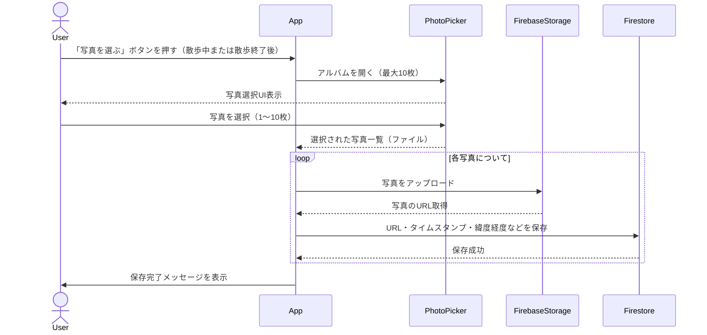

##  写真の選択と保存処理の連携（最大10枚）

```mermaid
sequenceDiagram
    actor User
    participant App
    participant PhotoPicker
    participant FirebaseStorage
    participant Firestore

    User ->> App: 「写真を選ぶ」ボタンを押す（散歩中または散歩終了後）
    App ->> PhotoPicker: アルバムを開く（最大10枚）
    PhotoPicker -->> User: 写真選択UI表示
    User ->> PhotoPicker: 写真を選択（1〜10枚）
    PhotoPicker -->> App: 選択された写真一覧（ファイル）

    loop 各写真について
        App ->> FirebaseStorage: 写真をアップロード
        FirebaseStorage -->> App: 写真のURL取得
        App ->> Firestore: URL・タイムスタンプ・緯度経度などを保存
        Firestore -->> App: 保存成功
    end

    App ->> User: 保存完了メッセージを表示

```
